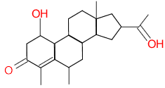
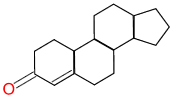
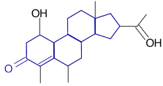

Cheminformatics Basics
======================

What is Cheminformatics?
^^^^^^^^^^^^^^^^^^^^^^^^

*Cheminformatics* is a cross between Computer Science and
Chemistry -- the process of storing and retrieving information about
chemical compounds.

*Information Systems* are concerned with storing, retrieving, and
searching information, and with storing *relationships* between
bits of data. For example:

+--------------+-------------------------+----------------------------------+-------------------------------------------------------+------------------------------------------------------+
| Operation    | Classical Information   |                                  | Chemical Information System                           |                                                      |
|              | System                  |                                  |                                                       |                                                      |
+==============+=========================+==================================+=======================================================+======================================================+
| Store        | Name = 'Jimmy Carter'   | Stores text, numbers, dates, ... | |image0|                                              | Stores chemical compounds and information about them |
+--------------+-------------------------+----------------------------------+-------------------------------------------------------+------------------------------------------------------+
| Retrieve     | Find record #13282      | Retrieves 'Jimmy Carter'         | Find CC(=O)C4CC3C2CC(C)C1=C(C)...                     | Retrieves: |image0|                                  |
|              |                         |                                  | C(=O)CC(O)C1C2CCC3(C)C4                               |                                                      |
+--------------+-------------------------+----------------------------------+-------------------------------------------------------+------------------------------------------------------+
| Search       | Find Presidents named   | George Bush and George           | Find molecules containing |image2|                    | Retrieves: |image3|                                  |
|              | 'Bush'                  | W. Bush                          |                                                       |                                                      |
+--------------+-------------------------+----------------------------------+-------------------------------------------------------+------------------------------------------------------+
| Relationship | Year Carter was elected | Answer: Elected in 1976          | What's the logP(o/w) of |image2|                      | Answer: logP(o/W) = 2.62                             |
+--------------+-------------------------+----------------------------------+-------------------------------------------------------+------------------------------------------------------+

How is Cheminformatics Different?
^^^^^^^^^^^^^^^^^^^^^^^^^^^^^^^^^

There are four key problems a cheminformatics system solves:

1. **Store a Molecule**

   Computer scientists usually use the *valence model* of chemistry to
   represent compounds. Section 2,
   :ref:`101 Representing Molecules`,
   discusses this at length.

2. **Find exact molecule**

   If you ask, "Is Abraham Lincoln in the database?" it's not hard to
   find the answer. But, given a specific molecule, is it in the
   database? What do we know about it? This may seem seem simple at
   first glance, but it's not, as we'll see when we discuss tautomers,
   stereochemistry, metals, and other "flaws" in the valence model of
   chemistry.

3. **Substructure search**

   If you ask, "Is anyone named Lincoln in the database?" you usually
   expect to find the former President and a number of others - this
   is called a *search* rather than a *lookup*. For a chemical
   informatics system, we have a *substructure search*: Find all
   molecules containing a partial molecule (the "substructure") drawn
   by the user. The substructure is usually a functional group,
   "scaffold", or core structure representing a class of molecules.
   This too is a hard problem, *much* harder than most text searches,
   for reasons that go to the very root of mathematics and the theory
   of computability.

4. **Similarity search**

   Some databases can find similar-sounding or misspelled words, such as "Find Lincon" or "find Cincinati", which respectively might find
   Abraham Lincoln and Cincinnati. Many chemical information systems can find molecules similar to a given molecule, ranked by
   similarity. There are several ways to measure molecular similarity, discussed further in Section 4,
   :ref:`101 Molecular Similarity`.

