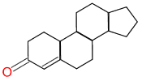
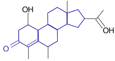
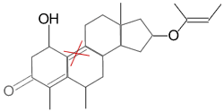

.. include:: <xhtml1-symbol.txt>

Representing Molecules
======================

What is a Molecule?
^^^^^^^^^^^^^^^^^^^

One of the greatest achievements in chemistry was the development
of the *valence model* of chemistry, where a molecule is
represented as *atoms* joined by semi-rigid *bonds* that can be
single, double, or triple. This simple mental model has little
resemblance to the underlying quantum-mechanical reality of
electrons, protons and neutrons, yet it has proved to be a
remarkably useful approximation of how atoms behave in close
proximity to one another, and has been the foundation of chemical
instruction for well over a century.

The valence model is also the foundation of modern chemical
information systems. When a Computer Scientist approaches a
problem, the first task is to figure out a *datamodel* that
represents the problem to be solved as *information*. To the
Computer Scientist, the valence model naturally transforms into a
*graph*, where the *nodes* are atoms and the *edges* are bonds.
Computer Scientists know how to manipulate graphs - mathematical
graph theory and computer science have been closely allied since
the invention of the digital computer.

.. epigraph::

  *There are atoms and space. Everything else is opinion.*
 
  -- Democritus

However, the valence model of chemistry has many shortcomings. The
most obvious is aromaticity, which quickly required adding the
concept of a non-integral "aromatic" distributed bond, to the
single/double/triple bonds of the simple valence model. And that
was just the start - tautomers, ferrocenes, charged molecules and a
host of other common molecules simply don't fit the valence model
well.

This complicates life for the computer scientist. As we shall see,
they are the source of most of the complexity of modern
cheminformatics systems.

Older systems: Connection Tables
^^^^^^^^^^^^^^^^^^^^^^^^^^^^^^^^

Most of the early (and some modern) representations of molecules
were in a *connection table*, literally, a table enumerating the
atoms, and a table enumerating the bonds and which atoms each bond
connected. Here is an example of connection-table (CTAB) portion of
an MDL "SD" file (the data portion is not shown here):

::

    
    MOLCONV
    
    3 2  0  0  1  0              1 V2000
    5.9800   -0.0000   -0.0000 Br  0  0  0  0  0  0
    4.4000   -0.6600    0.8300 C   0  0  0  0  0  0
    3.5400   -1.3500   -0.1900 C   0  0  0  0  0  0
    1  2  1  0
    2  3  1  0

This simple example illustrates most of the key features. The
molecule has three atoms, two bonds, and is provided with
three-dimensional (x,y,z) coordinates. MDL provides
`extensive documentation <http://www.mdli.com/downloads/downloadable/index.jsp>`_
for their various CTFile formats if you are interested in the
details.

Connection tables can capture the valence model of chemistry fairly
well, but they suffer from two problems:

They are very inefficient, taking on the order of a dozen or two of
bytes of data per atom and per bond. Newer line notations
(discussed below) represent a molecules with an average of 1.2 to
1.5 bytes per atom, or 6-8 bytes per atom if coordinates are added.
Many suffered from lack of specificity. For example, since
hydrogens are often not specified, there can be ambiguity as to the
electronic state of some molecules, because the connection-table
format does not explicitly state the valence assumptions.
Most mix the concept of *connectivity* (what are the atoms and how
are they connected?) with other data such as 2D and 3D coordinates.
For example, if you had two different conformers of a molecule,
most connection tables would require you to specify the entire
molecule twice, even though the connection table is identical in
both.

Line Notations: InChI, SMILES, WLN and others
^^^^^^^^^^^^^^^^^^^^^^^^^^^^^^^^^^^^^^^^^^^^^

A *line notation* represents a molecule as a single-line string of
characters.

    **WLN - Wisswesser Line Notation**
        WLN, invented by William J. Wisswesser in the early 1950's, was the
        first comprehensive line notation, capable of representing
        arbitrarily complex molecules correctly and compactly.

        ::

            1H = CH4 Methane
            2H = CH3-CH3 Ethane
            3H = CH3-CH2-CH3 Propane 
            QVR BG CG DG EG FG = C7HCl5O2 Pentachlorbenzoate

        WLN was the first line notation to feature a *canonical form*, that
        is, the rules for WLN meant there was only one "correct" WLN for
        any particular molecule. Those versed in WLN were able to write
        molecular structure in a line format, communicate molecular
        structure to one another and to computer programs. Unfortunately,
        WLN's complexity prevented widespread adoption. The rules for
        correct specification of WLN filled a small book, encoding those
        rules into a computer proved difficult, and the rules for the
        `canonicalization <#canonicalization>`_ were computationally
        intractable.

    **SMILES - Simplified Molecular Input Line Entry System**
        The best-known line notation today is SMILES. It was by Arthur and
        David Weininger in response to a need for a simpler, more "human
        accessible" notation than WLN. While SMILES is not trivial to learn
        and write, most chemists can create correct SMILES with just a few
        minutes training, and the entire SMILES language can be learned in
        an hour or two. You can
        `read more details here <http://www.opensmiles.org/spec/open-smiles.html>`_.
        Here are some examples:

        ::

              C          methane
              CC         ethane
              C=C        ethene
              Oc1ccccc1  phenol

        SMILES, like WLN, has a *canonical form*, but unlike WLN, Weininger
        relied on the computer, rather than the chemist, to convert a
        non-canonical SMILES to a canonical SMILES. This important
        separation of duties was key to making SMILES easy to enter. (Read
        more about canonicalization below.)

    **InChI**
        InChI is the latest and most modern of the line notations. It
        resolves many of the chemical ambiguities not addressed by SMILES,
        particularly with respect to stereo centers, tautomers and other of
        the "valence model problems" discussed in the
        `opening section <cheminformatics-101.htm#A1>`_ of this document.

        You can read more about InChI at the
        `Official Web Site <http://www.iupac.org/projects/2000/2000-025-1-800.html>`_,
        or on the
        `Unofficial InChI FAQ page <http://wwmm.ch.cam.ac.uk/inchifaq/index.html>`_.

Canonicalization
^^^^^^^^^^^^^^^^

A critical feature of line notations is *canonicalization* - the
ability to choose one "blessed" representation from among the many.
Consider:

::

      OCC   ethanol
      CCO   ethanol

Both of these SMILES represent the same molecule. If we could all
agree that one of these was the "correct" or "canonical" SMILES for
ethanol, then we would *always store it the same way* in our
database. More importantly, if we want to ask, "Is ethanol in our
database" we know that it will only be there once, and that we can
generate the canonical SMILES for ethanol and look it up.

(Note that in theory one can create a canonical connection table,
too, but it's not as useful since informatics systems usually have
trouble indexing BLOBs - large objects.)

Line Notation versus Connection Tables: A practical matter
^^^^^^^^^^^^^^^^^^^^^^^^^^^^^^^^^^^^^^^^^^^^^^^^^^^^^^^^^^

Why are line notations preferred over connection-table formats? In
theory, either could express the same information. But there are
practical difference, mostly related to the complexity of "parsing"
a connection table. If you know that the whole molecule is on one
line of a file, it's easy to parse.

Line notations are also very nice for database applications.
Relational databases have datatypes that, roughly speaking, are
divided into numbers, text, and "everything else", also known as
"BLOBs" (Binary Large OBjects). You can store line notations in the
"text" fields much more easily than connection tables.

Line notations also have pragmatic advantages. Modern Unix-like
systems (such as UNIX, Linux and Cygwin) have a number of very
powerful "filter" text-processing programs that can be "piped"
together (connected end-to-end) to perform important tasks. For
example, to count the number of molecules containing aliphatic
nitrogen in a SMILES file, I can simply:

::

    grep N <file.smi | wc

("grep" looks for a particular expression, in this case "N", and
prints any line that contains it, and wc ("word count") counts the
number of words and lines.)

This is just a simple example of the power available via "script"
programs using "filters" on Unix-like systems. Unix "filters" are
much less useful for connection-table formats, because each
molecule is spread over many lines.

Query Languages: SMARTS
^^^^^^^^^^^^^^^^^^^^^^^

In addition to a typographical way to represent molecules, we also
need a way to enter *queries* about molecules, such as, "Find all
molecules that contain a phenol."

With text, we're familiar with the concept of typing a partial
word, such as "ford" to find "Henry Ford" as well as "John
Hartford". For chemistry, we can also specify partial structures,
and find anything that contains them. For example:

+----------+----------+-----------------------------------------------+
| Query    | Database | Matches?                                      |
+==========+==========+===============================================+
| |image0| | |image1| | **YES** (matched portion highlighted in blue) |
+----------+----------+-----------------------------------------------+
| |image0| | |image2| | **NO** (double bond indicated doesn't match)  |
+----------+----------+-----------------------------------------------+

.. sidebar:: eMolecules, Inc.

   .. image:: ../_static/eMolecules.png
      :align: center
   
   eMolecules_ is a one-stop shop for suppliers and information for over 8 million chemical compounds. Under the hood is a chemical registration technology based on Open Babel.

.. _eMolecules: http://www.emolecules.com

The simplest query language for chemistry is SMILES itself: Just
specify a structure, such as ``Oc1ccccc1``, and search. This is how
eMolecules' basic searching works (see Sidebar). It's simple and, because of the
high-performance indexes in eMolecules, it is very fast.

However, for general-purpose cheminformatics, one needs more power.
What if the substructure you're looking for isn't a valid molecule?
For example ``ClccBr`` (1,2- substitution on an aromatic ring) isn't a
whole molecule, since the concept of aromaticity is only sensible
in the context of a whole ring system.

Or what if the thing we're looking for isn't a simple atom such as
Br, but rather a concept like "Halogen"? Or, "A terminal methyl"?

To address this, cheminformatics systems have special
*query languages*, such as SMARTS (SMiles ARbitrary Target
Specification). SMARTS is a close cousin to SMILES, but it has
*expressions* instead of simple atoms and bonds. For example, ``[C,N]``
will find an atom that is either carbon or nitrogen.

IUPAC Names, Trade Names, Common Names
^^^^^^^^^^^^^^^^^^^^^^^^^^^^^^^^^^^^^^

Chemistry also has three other important name systems:

**IUPAC Names**
  `IUPAC <http://www.iupac.org/dhtml_home.html>`_
  (the International
  Union of Pure and Applied Chemistry) established a
  `naming convention <http://www.chem.qmul.ac.uk/iupac/>`_ that is
  widely used throughout chemistry. Any chemical can be named, and
  all IUPAC names are unambiguous. This textual representation is
  aimed at humans, not computers: Chemists versed in IUPAC
  nomenclature (which is widely taught) can read an IUPAC name and
  visualize or draw the molecule.
**Trade Names**
  Names such as Tylenol\ |trade| and Valium\ |trade| are given to compounds
  and formulations by manufacturers for marketing and sales purposes,
  and for regulatory purposes.
**Common names**
  Names such as "aspirin" or "alcohol" for
  substances that are in widespread use.

