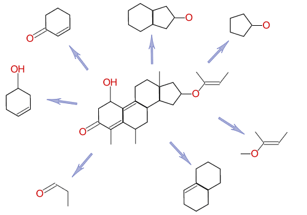

Substructure Searching with Indexes
===================================

What is Indexing?
^^^^^^^^^^^^^^^^^

Indexing is pre-computing the answers to portions of expected
questions *before* they're asked, so that when the question comes,
it can be answered quickly.

Take your favorite search engine (AOL, Yahoo!, Google, MSN, ...)
for example. Without indexing, they might wait until you ask for
"John Hartford Bluegrass", then start searching the web, and in a
year or two find all the web pages about the deceased banjo/fiddle
player and steamboat captain. That would probably not impress you.

Instead, these search engines search the web *before* you ask your
question, and build an *index* of the words they find. When you
type in "Bluegrass John Hartford", they already know all of the
pages that have "John", all of the pages with "Hartford", and all
of the pages with "Bluegrass". Instead of searching, they examine
their index, and find pages that are on *all three* lists, and
quickly find your results. (NB: It's actually a lot more complex,
but this illustrates the main idea of indexing.)

Indexes for Chemicals
^^^^^^^^^^^^^^^^^^^^^

Instead of indexing words, cheminformatics systems index
*substructures*. Although there are many schemes for doing this,
cheminformatics systems all use the same fundamental principle:
they *decompose the molecule* into smaller bits, and index those.

Roughly speaking, a cheminformatics system will index each of the
substructures (fragments) above, so that every molecule that
contains each fragment is known.

When a query is entered, the cheminformatics system breaks apart
the query using the same technique, to find all of the fragments in
the query. It then checks its index for each fragment, and combines
the lists it finds to get only those molecules that have *all* of
those fragments.

This doesn't mean that all molecules returned by the index actually
are matches. In the language of databases, we say the index will
return *false positives*, candidate molecules that don't actually
match the substructure search.

Consider our example of searching for "John Hartford" - the index
might return many pages that have both "John" and "Hartford", yet
have nothing to do with bluegrass music or steamboats. For example,
it might return a page containing, "President John F. Kennedy
visited Hartford, Connecticut today...". To confirm that the search
system has found something relevant, it must check the pages return
from the index to ensure that the specific phrase "John Hartford"
is present. However, notice that this is *much* faster than
searching every page, since the overwhelming majority of web pages
were instantly rejected because they have neither "John" nor
"Hartford" on them.

Similarly, a chemical fragment index serves to find only the most
*likely* molecules for our substructure match - anything that the
index didn't find is definitely not a match. But we still have to
examine each of the molecules returned by the indexing system and
verify that the complete substructure for which we are searching is
present.

NP-Complete - A Little about Computability
^^^^^^^^^^^^^^^^^^^^^^^^^^^^^^^^^^^^^^^^^^

Searching through a page of text for the words "John Hartford" is
pretty easy for a modern computer. Although false positives
returned by the index are a nuisance and impair performance, they
are not a catastrophe. Not so for substructure matching.
Unfortunately, substructure matching falls into a category of
"hard" mathematical problems, which means false positives from the
index are a big problem.

Substructure matching (finding a certain functional group within a
molecule) is an example of what mathematicians call
`graph isomorphism <http://planetmath.org/?op=getobj&from=objects&id=1708>`_,
and is in a class of problems called
`NP Complete <http://en.wikipedia.org/wiki/Np_complete>`_.
Roughly speaking, this means the time it takes to do a substructure
search is non-polynomial, i.e. exponential in the number of atoms
and bonds. To see why this is a computational disaster, compare two
tasks, one that takes polynomial time,
k\ :sub:`1`\ \*N\ :sup:`2`\ , versus one that takes exponential
time k\ :sub:`2`\ \*2\ :sup:`N`\ . Our polynomial task is bad
enough: If we double N, it takes *four times* as long to solve. But
the exponential task is worse:
*Every time we add an atom it doubles*. So going from one atom to
two doubles the time, and going from 100 atoms to 101 atoms doubles
the time. Even if we can get k\ :sub:`2`\  down to a millionth of
k\ :sub:`1`\ , we're still in trouble - a million is just
2\ :sup:`20`\  or twenty atoms away.

It has been mathematically proven that substructure searching is in
the set of NP Complete problems, so there's no point wasting our
time searching for a polynomial algorithm. The good news is that
most molecules have "low connectivity", meaning most atoms have
fewer than four bonds, unlike the weird and twisted graphs that
mathematicians consider. In practice, most substructure matching
can be done in polynomial time around N\ :sup:`2`\  or
N\ :sup:`3`\ . But even with this improvement, substructure
matching is an "expensive" time-consuming task for a computer.

The key point is that indexing is particularly important for
cheminformatics systems. The typical modern computer can only
examine a few thousand molecules per second, so examining millions
of molecules one-by-one is out of the question. The indexing done
by a modern cheminformatics system is the key to its performance.

