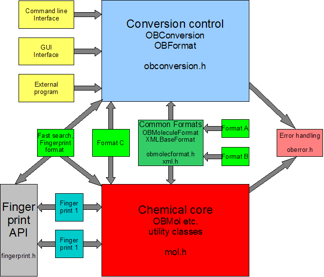

Developing Open Babel
=====================

Due to its open nature of its development, Open Babel contains code contributed by a wide variety of developers (see :ref:`Thanks`). This section describes some general guidelines and "best practices" for code developers.

.. _version control:

Developer Resources
-------------------

For new and existing developers here are some useful resources:

- SourceForge `project page <http://www.sf.net/projects/openbabel>`_
- Development version `API documentation <http://openbabel.org/dev-api>`_ and `documentation bugs <http://openbabel.org/dev-api/docbuild.out>`_
- Nightly build and test `dashboard <http://my.cdash.org/index.php?project=Open%20Babel>`_
- RSS feed for SVN commits at `CIA.vc <http://cia.vc/stats/project/OpenBabel>`_

Working with the Development Code
---------------------------------

To download and update the latest version of the Open Babel source code, you need Subversion. Subversion_  (or SVN) is the name of the project used to maintain the Open Babel version control repository. There are many clients for Subversion, including command-line and GUI applications (for example, on Windows, TortoiseSVN_). For more links, see the Subversion website_. There's also a great book about using Subversion, which is available online_.

.. _Subversion: http://subversion.tigris.org/ 
.. _online: http://svnbook.red-bean.com/
.. _website: http://subversion.tigris.org/links.html
.. _TortoiseSVN: http://tortoisesvn.tigris.org/

Keeping up to date with Subversion
^^^^^^^^^^^^^^^^^^^^^^^^^^^^^^^^^^

(1) Check out the latest development version::

      svn co https://openbabel.svn.sourceforge.net/svnroot/openbabel/openbabel/trunk 

    This creates a directory called :file:`trunk`, which contains the latest source code from Open Babel.

(2) Configure and compile this using CMake (see :ref:`Compiling Open Babel`).

(3) After some time passes, and you want the latest bug fixes or new features, you may want to update your source code. To do this, go into the :file:`trunk` directory you created above, and type::

      svn update

(4) Do step (2) again.

(5) If, after updating, the compilation fails please report it to the Open Babel mailing list. In the meanwhile, if you want to go back to a particular revision (that is, if you don't want to use the latest one), just use ``svn info`` to find the number of the current revision, and update to an earlier revision either by date or by revision number::

      $ svn info
      ...
      Revision: 1740
      ...
      $ svn update -r 1735
      (or)
      $ svn update -r {2007-01-01}

Useful Subversion Commands
^^^^^^^^^^^^^^^^^^^^^^^^^^

The following table suggests Subversion commands useful for Open Babel contributors. More documentation can be found in the Official SVN Manual. In the following examples, *repo* should be replaced by the full URL to the Open Babel subversion repository (https://openbabel.svn.sourceforge.net/svnroot/openbabel/openbabel).

=================================   ============
Subversion Command                  What it does
=================================   ============
``svn co repo/trunk``               Check out the latest development version of Open Babel
``svn update``                      Update the current directory and subdirectories with any new changes
``svn add filename``                Add the file :file:`filename` to the repository
``svn remove filename``             Remove the file :file:`filename` (before a commit)
``svn mv filename newname``         Move/rename the file :file:`filename` to :file:`newname`
``svn commit``                      Commit the changes to the central repository
``svn diff``                        Return a diff set of differences between the working copy and the central repository
``svn switch repo/branches/foo``    Switch the current working copy to a branch named foo
``svn copy repo/branches/foo``      Create a branch named foo with the current working copy 
=================================   ============

Patches and Changesets
^^^^^^^^^^^^^^^^^^^^^^

We're human -- it's much easier to understand exactly what a patch is doing if it's not trying to add 20 features or fix 20 bugs at once. (Hopefully there won't be a need to fix 20 bugs!) If you want to add several features or fix several bugs, break the patch up into one for each request. The faster someone can understand your patch, the faster it will go into the source. Everyone benefits from faster, quality development.

Similarly, it's sometimes necessary to revert the code to an older version because of bugs. Each set of changes should only touch as few files as are needed. This makes it easier for others to review your changes and undo them if necessarily. (Again, hopefully there's never a need, but this is certainly a "best practice" to make life easier for everyone.)

Monitoring Progress
-------------------

Developers should keep track of changes made by others. Like most open source projects, development occurs in many places by many contributors. Therefore it is important to keep up-to-date with your code repository and keep on top of changes made by others. A bug you just found in the latest release may have already been fixed by someone else.

    * `CIA Stats`_ on Open Babel (provides a webpage and RSS feed for every change)
    * OpenBabel-Updates_ mailing list (receives an e-mail message on every change) 

.. _CIA Stats: http://cia.vc/stats/project/openbabel
.. _OpenBabel-Updates: http://lists.sourceforge.net/lists/listinfo/openbabel-updates

In general, if you find that a recent update by another developer has introduced bugs or broken the code, please bring it up with them ASAP. We have a policy of "if you break it, you fix it" to keep the source code repository always in a working state.

Modular design of code base
---------------------------

Since version 2.0, Open Babel has had a modular structure. Particularly for the use of Open Babel as a chemical file format converter, it aims to:

* separate the chemistry, the conversion process and the user interfaces, reducing, as far as possible, the dependency of one on another.
* put all the code for each chemical format in one place (usually a single cpp file) and make the addition of new formats simple.
* allow the format conversion of not just molecules, but also any other chemical objects, such as reactions. 

   The structure of the Open Babel codebase broken down into modules

The separate parts of the OpenBabel program are:

    * The **Chemical** core, which contains OBMol etc. and has all the chemical structure description and manipulation. This bit is the heart of the application and its API can be used as a chemical toolbox. It has no input/output capabilities. 

    * The **Formats**, which read and write to files of different types. These classes are derived from a common base class, OBFormat, which is in the Conversion Control module. They also make use of the chemical routines in the Chemical Core module. Each format file contains a global object of the format class. When the format is loaded the class constructor registers the presence of the class with OBConversion. This means the formats are plugins - new formats can be added without changing any framework code. 

    * **Common Formats** include OBMoleculeFormats and XMLBaseFormat from which most other formats (like Format A and Format B in the diagram) are derived. Independent formats like Format C are also possible. 

    * The **Conversion** control, which also keeps track of the available formats, the conversion options and the input and output streams. It can be compiled without reference to any other parts of the program. In particular, it knows nothing of the Chemical core: mol.h is not included. 

    * The **User interface**, which may be a command line (in main.cpp), a Graphical User Interface(GUI), especially suited to Windows users and novices, or may be part of another program which uses OpenBabel's input and output facilities. This depends only on the Conversion control module (obconversion.h is included), but not on the Chemical core or on any of the Formats. 

    * The **Fingerprint API**, as well as being usable in external programs, is employed by the fastsearch and fingerprint formats. 

    * The **Fingerprints**, which are bit arrays which describe an object and which facilitate fast searching. They are also built as plugins, registering themselves with their base class OBFingerprint which is in the Fingerprint API. 

    * The **Error handling** can be used throughout the program to log and display errors and warnings (see below).

It is possible to build each box in the diagram as a separate DLL or shared library and the restricted dependencies can help to limit the amount of recompilation. For the formats or the fingerprints built in this way it may be possible to use only those whose DLL or so files are present when the program starts. Several formats or fingerprints may be present in a single dynamic library.

Alternatively, and most commonly, the same source code can be built into a single executable. The restricted dependencies still provide easier program maintenance.

This segregation means that a module can directly call code only in other modules connected to it by forward arrows. So some discipline is needed when adding new code, and sometimes non-obvious work-arounds are necessary. For instance, since the user interface doesn't know about the Chemical Core, if it were necessary to set any parameters in it, then this would have to be done through a pseudo format OBAPIInterface.

Sometimes one format needs to use code from another format, for example, rxnformat needs to read mol files with code from mdlformat. The calling format should not use the code directly but should do it through a OBConversion object configured with the appropriate helper format.

The objects passed between the modules in the diagram above are polymorphic :obapi:`OBBase` pointers. This means that the conversion framework can be used by any object derived from OBBase (which essentially means anything - chemical or not). Most commonly these refer to OBMol objects, less commonly to OBReaction objects, but could be extended to anything else without needing to change any existing code. 

.. _error handling:

Error Handling and Warnings
---------------------------

The general philosophy of the Open Babel project is to attempt to gracefully recover from error conditions. Depending on the severity of the error, a message may or may not be sent to the user -- users can filter out developer debugging messages and minor errors, but should be notified of significant problems.

Errors and warnings in Open Babel are handled internally by a flexible system motivated by a few factors:

* End users often do not wish to be deluged by debugging or other messages during operation.
* Other developers may wish to redirect or filter error/warning output (e.g., in a GUI).
* The operation of Open Babel should be open to developers and users alike to monitor an "audit trail" of operations on files and molecules, and debug the program and library itself when the need arises. 

Multiple error/warning levels exist and should be used by code. These are defined in the :obapi:`obMessageLevel` enum as follows:

* ``obError`` -- for critical errors (e.g., cannot read a file)
* ``obWarning`` -- for non-critical problems (e.g., molecule appears empty)
* ``obInfo`` -- for informative messages (e.g., file is a non-standard format)
* ``obAuditMsg`` -- for messages auditing methods which destroy or perceive molecular data (e.g., kekulization, atom typing, etc.)
* ``obDebug`` -- for messages only useful for debugging purposes 

The default filter level is set to ``obWarning``, which means that users are told of critical errors, but not non-standard formatting of input files. 

A global error handler :obapi:`obErrorLog` (an instance of :obapi:`OBMessageHandler`) is defined and should be used as shown in the API documentation for the :obapi:`OBMessageHandler` class.

.. _lazy evaluation:

Lazy Evaluation
---------------

The :obapi:`OBMol::BeginModify() <OpenBabel::OBMol::BeginModify>` and :obapi:`OBMol::EndModify() <OpenBabel::OBMol::EndModify>` calls are part of Open Babel's lazy evaluation mechanism.

In some cases, code may desire to make a large number of changes to an OBMol object at once. Ideally, this should all happen without triggering unintended perception routines. Therefore, the ``BeginModify()`` call marks the beginning of such code, and ``EndModify()`` triggers any needed updates of lazy evaluation methods.

.. highlight:: c++

For example::

    mol.BeginModify();
    double x,y,z;
    OBAtom *atom;
    vector<string> vs;

    for (i = 1; i <= natoms; i ++)
    {
        if (!ifs.getline(buffer,BUFF_SIZE))
            return(false);
        tokenize(vs,buffer);
        if (vs.size() != 4)
            return(false);

        atom = mol.NewAtom();
        x = atof((char*)vs[1].c_str());
        y = atof((char*)vs[2].c_str());
        z = atof((char*)vs[3].c_str());

        atom->SetVector(x,y,z); //set coordinates
        atom->SetAtomicNum(atoi(vs[0].c_str())); // set atomic number
    }
    mol.ConnectTheDots();
    mol.PerceiveBondOrders();
    mol.EndModify();

This code reads in a list of atoms with XYZ coordinates and the atomic number in the first column (``vs[0]``). Since hundreds or thousands of atoms could be added to a molecule, followed by creating bonds, the code is enclosed in a ``BeginModify()``/``EndModify()`` pair. 
