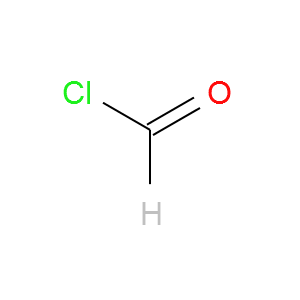

2D Depiction
=========

As the old Chinese proverb has it, a molecular depiction is worth a
thousand words. This chapter covers everything relevant to using Open
Babel to generate or read/write a 2D depiction, expected by most
chemists for print or website purposes.

When we talk about a depiction in cheminformatics, there are really two different concepts covered by this term:

1. Graphical display of a molecule's structure as a 2D image (such as the PNG and SVG formats). Here is an example::

     obabel -:C(=O)Cl -O acidchloride.png

2. Storage of the 2D coordinates (and associated stereo symbols) associated with Concept 1 (using formats such as Mol and Mol2). Here is the connection table from the corresponding Mol file for the above depiction::

    3  2  0  0  0  0  0  0  0  0999 V2000
      0.8660   -0.5000    0.0000 C   0  0  0  0  0  0  0  0  0  0  0  0
      1.7321   -0.0000    0.0000 O   0  0  0  0  0  0  0  0  0  0  0  0
      0.0000    0.0000    0.0000 Cl  0  0  0  0  0  0  0  0  0  0  0  0
    1  2  2  0  0  0  0
    1  3  1  0  0  0  0

.. note::

        The focus in this chapter is on 2D depiction and not 3D. It is of course possible to generate and store 3D coordinates in many of the file formats supported by Open Babel, but the only support for depiction is the Povray format, used to create ray-traced ball-and-stick diagrams of molecules.
        Other Open Source chemistry projects such as `Avogadro <http://avogadro.sf.net>`_, `PyMOL <http://pymol.org>`_, and `Jmol <http://jmol.org>`_ cover this area very well.

Molecular graphics
------------------

As of Open Babel 2.3.2, there are three output formats for displaying a 2D image:

1. PNG format: This is a bitmap format used to create images of a certain
   pixel width. These images can be inserted into Word documents or displayed
   on web pages.

2. SVG format: This is a vector format, which can be scaled to generate images
   of any size without loss of quality. In particular, Open Babel's SVG images
   can be interactively zoomed and panned using a modern web browser.

3. ASCII format: This is a depiction of a molecule using ASCII text. This can
   be useful if you are logged into a remote server, or are working at the
   command-line, and just need a basic check of the identity of a molecule.

All of these formats support multimolecule files. The PNG and SVG formats
arrange the molecules into rows and columns (you can specify the number of rows or columns if you wish), while the ASCII format just uses a single column. The remainder of this chapter will concentrate on the PNG and SVG formats; for more information on the ASCII format, see the format description [ref].
