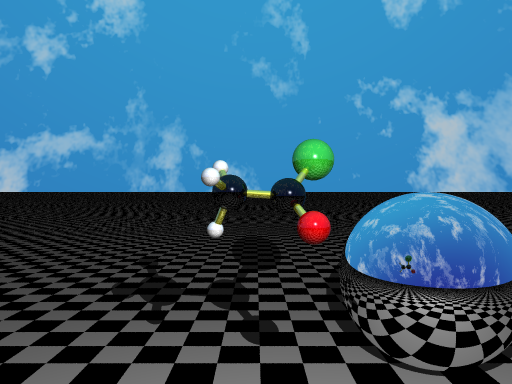

.. _POV-Ray_input_format:

POV-Ray input format (pov)
==========================

**Generate an input file for the open source POV-Ray ray tracer.**

The POV-Ray file generated by Open Babel should be considered a starting
point for the user to create a rendered image of a molecule. Although care
is taken to center the camera on the molecule, the user will probably want
to adjust the viewpoint, change the lighting, textures, etc.

The file :file:`babel_povray3.inc` is required to render the povray file
generated by Open Babel. This file is included in the Open Babel
distribution, and it should be copied into the same directory as the
.pov file before rendering.

For example, the image below was generated by rendering the output from::

  obabel -:"CC(=O)Cl acid chloride" --gen3d -O chloride.pov -xc -xf -xs

.. note:: This is a write-only format.

Write Options
~~~~~~~~~~~~~ 

-c  *Add a black and white checkerboard*
-f  *Add a mirror sphere*
-m <model-type>  *BAS (ball-and-stick), SPF (space-fill) or CST (capped sticks)*

    The default option is ball-and-stick. To choose space-fill, you would use
    the following command line::
 
      obabel aspirin.mol -O aspirin.pov -xm SPF
 
-s  *Add a sky (with clouds)*
-t  *Use transparent textures*
