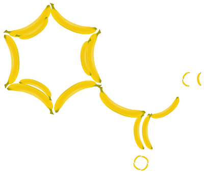

.. _Painter_format:

Painter format (paint)
======================

**Commands used to generate a 2D depiction of a molecule**

This is a utility format that is useful if you want to
generate a depiction of a molecule yourself, for example
by drawing on a Graphics2D canvas in Java. The format
writes out a list of drawing commands as shown
in the following example::

  obabel -:CC(=O)Cl -opaint

  NewCanvas 149.3 140.0
  SetPenColor 0.0 0.0 0.0 1.0 (rgba)
  DrawLine 109.3 100.0 to 74.6 80.0
  SetPenColor 0.0 0.0 0.0 1.0 (rgba)
  DrawLine 71.6 80.0 to 71.6 53.0
  DrawLine 77.6 80.0 to 77.6 53.0
  SetPenColor 0.0 0.0 0.0 1.0 (rgba)
  DrawLine 74.6 80.0 to 51.3 93.5
  SetPenColor 0.4 0.4 0.4 1.0 (rgba)
  SetPenColor 0.4 0.4 0.4 1.0 (rgba)
  SetPenColor 1.0 0.1 0.1 1.0 (rgba)
  SetFontSize 16
  SetFontSize 16
  SetFontSize 16
  DrawText 74.6 40.0 "O"
  SetPenColor 0.1 0.9 0.1 1.0 (rgba)
  SetFontSize 16
  SetFontSize 16
  SetFontSize 16
  SetFontSize 16
  DrawText 40.0 100.0 "Cl"

Note that the origin is considered to be in the top left corner.

The following image was drawn using the information
in this format as described at
http://baoilleach.blogspot.co.uk/2012/04/painting-molecules-your-way-introducing.html:

.. note:: This is a write-only format.

Write Options
~~~~~~~~~~~~~ 

-M  *Do not include a margin around the depiction*

