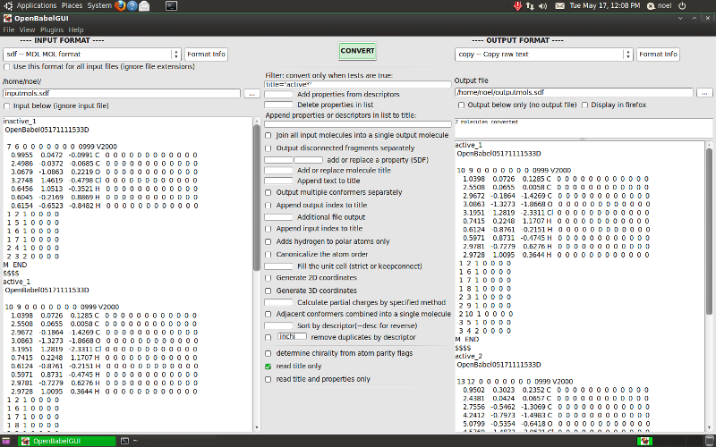

.. _GUI:

The Open Babel GUI
------------------

The :command:`obabel` command line program converts chemical objects (currently molecules or reactions) from one file format to another. The Open Babel graphical user interface (GUI) is an
alternative to using the command line and has the same capabilities. Since Open Babel 2.3, the GUI is available cross-platform on Windows, Linux and MacOSX. On Windows, you can find it in the Start Menu in the Open Babel folder; on Linux and MacOSX, the GUI can be started with the :command:`obgui` command.

Since the functionality of the GUI mirrors that of :command:`obabel`, you should consult the :ref:`previous chapter <obabel>` to learn about available features and how to use them. This chapter describes the general use of the GUI and then focuses on features that are specific to the GUI.

Basic operation
~~~~~~~~~~~~~~~
Although the GUI presents many options, the basic operation is straightforward:

- Select the type of the type of the input file from the dropdown list.

- Click the ":guilabel:`...`" button and select the file. Its contents are displayed in the textbox below.

- Choose the output format and file in a similar way. You can merely display the output without saving it by not selecting an output file or by checking ":guilabel:`Output below only..`".

- Click the ":guilabel:`Convert`" button.

The message window below the button gives the number of molecules
converted, and the contents of the output file are displayed.

By default, all the molecules in an input file are converted if the
output format allows multiple molecules.

   **Screenshot of GUI running on BioLinux 6.0, an Ubuntu derivative**

Options
~~~~~~~

The options in the middle are those appropriate for the type of
chemical object being converted (molecule or reaction) and the
input and output formats. They are derived from the description
text that is displayed with the ``-Hxxx`` option in the command line
interface and with the ":guilabel:`Format info`" buttons here. You can switch
off the display of any of the various types of option using the
:guilabel:`View` menu if the screen is getting too cluttered.

Multiple input files
~~~~~~~~~~~~~~~~~~~~

You can select multiple input files in the input file dialog in the
normal way (for example, using the Control key in Windows). In the input
filename box, each filename is displayed relative to the path shown
just above the box, which is the path of the first file. You can
display any of the files by moving the highlight with Tab/Shift
Tab, Page Up/Down, the mouse wheel, or by double clicking.

Selecting one or more new file names normally removes those already
present, but they can instead be appended by holding the Control
key down when leaving the file selection dialog.

Files can be also be dragged and dropped (e.g. from Windows
Explorer), adding the file when the Control key is pressed,
replacing the existing files when it is not.

Normally each file is converted according to its extension and the
input files do not have to be all the same, but if you want to use
non-standard file names set the checkbox ":guilabel:`Use this format for all
input files...`"

If you want to combine multiple molecules (from one or more files)
into a single molecule with disconnected parts, use option ":guilabel:`Join
all input molecules...`"

Wildcards in filenames
~~~~~~~~~~~~~~~~~~~~~~

When input filenames are typed in directly, any of them can
contain the wildcard characters ``*`` and ``?``. Typing Enter will replace
these by a list of the matching files. The wildcarded names can be
restored by typing Enter while holding down the Shift key. The
original or the expanded versions will behave the same when the
":guilabel:`Convert`" button is pressed.

By including the wildcard ``*`` in both the input and output
filenames you can carry out batch conversion. Suppose there were
files :file:`first.smi`, :file:`second.smi`, :file:`third.smi`. Using ``*.smi`` as the input
filename and ``*.mol`` as the output filename would produce three
files :file:`first.mol`, :file:`second.mol` and :file:`third.mol`. If the output filename
was ``NEW_*.mol``, then the output files would be :file:`NEW_first.mol`, etc.

Local input
~~~~~~~~~~~

By checking the ":guilabel:`Input below...`" checkbox you can type the input
text directly. The text box changes colour to remind you that it is
this text and not the contents of any files that will be
converted.

Output file
~~~~~~~~~~~

The output file name can be fully specified with a path, but if it
is not, then it is considered to be relative to the input file
path.

Graphical display
~~~~~~~~~~~~~~~~~

The chemical structures being converted can be displayed (as SVG)
in an external program. By default this is Firefox but it can be
changed from an item on the :guilabel:`View` menu (for instance, Opera and
Chrome work fine). When ":guilabel:`Display in firefox`" (under the output file
name) is checked, the structures will be shown in a new Firefox
tab. With multiple molecules the display can be zoomed (mousewheel)
and panned (dragging with mouse button depressed). Up to 100
molecules are easily handled but with more the system may be slow
to manipulate. It may also be slow to generate, especially if 2D
atom coordinates have to be calculated (e.g.from SMILES). A new
Firefox tab is opened each time :guilabel:`Convert` is pressed.

Using a restricted set of formats
~~~~~~~~~~~~~~~~~~~~~~~~~~~~~~~~~

It is likely that you will only be interested in a subset of the large range of formats handled by Open Babel.
You can restrict
the choice offered in the dropdown boxes, which makes routine
selection easier. Clicking ":guilabel:`Select set of formats`" on the :guilabel:`View` menu
allows the formats to be displayed to be selected. Subsequently,
clicking ":guilabel:`Use restricted set of formats`" on the :guilabel:`View` menu toggles
this facility on and off.

Using a restricted set overcomes an irritating bug in the Windows
version. In the file :guilabel:`Open` and :guilabel:`Save` dialogs the files displayed can
be filtered by the *current format*, *All Chemical Formats*, or *All
Files*. The *All Chemical Formats* filter will only display the first
30 possible formats (alphabetically). The *All Files* will indeed
display all files and the conversion processes are unaffected.

Other features
~~~~~~~~~~~~~~

Most of the interface parameters, such as the selected format and
the window size and position, are remembered between sessions.

Using the :guilabel:`View` menu, the input and output text boxes can be set not
to wrap the text. At present you have to restart the program for
this to take effect.

The message box at the top of the output text window receives
program output on error and audit logging, and some progress
reports. It can be expanded by dragging down the divider between
the windows.

Example files
~~~~~~~~~~~~~

In the Windows distribution, there are three chemical files included to try out:

* **serotonin.mol** which has 3D atom coordinates
* **oxamide.cml** which is 2D and has a large number of properties that will be seen when converting to SDF
* **FourSmallMols.cml** which (unsurprisingly) contains four molecules with no atom coordinates and can be used to illustrate the handling of multiple molecules:

  Setting the output format to SMI (which is easy to see), you can convert only the second and third molecules by entering ``2`` and ``3`` in the appropriate option boxes. Or convert only molecules with C-O single bonds by entering ``CO`` in the SMARTS option box.

