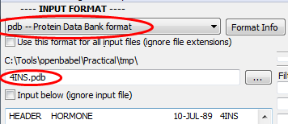
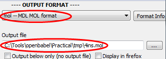
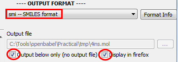

Converting chemical file formats
================================

The most common use of Open Babel is to convert chemical file formats. The following examples show how this is done.

File conversion
---------------

Let's convert a PDB file to MOL format:

* Create a folder on the Desktop called :file:`Work`
* Download the PDB file for insulin (``4ins``) from the `Protein Data Bank <http://www.rcsb.org/pdb/download/downloadFile.do?fileFormat=pdb&compression=NO&structureId=4INS>`_ and save it in the :file:`Work` folder
* Set the input file format to PDB and the input filename to the downloaded PDB file

* Set the output file format to MOL and the output filename to file:`4ins.mol` in the :file:`Work` folder

* Now click :guilabel:`CONVERT`

Converting without files
------------------------

Rather than use input and output files, it is possible to paste the contents of a chemical file format into the input box, and see the results of the conversion in the output box.

Here we will try this with the SMILES format, and illustrate how stereochemistry is handled by SMILES:

.. sidebar:: Screenshot

  .. figure:: ../_static/inputfile_b.png

* Choose the SMILES format as the input format
* Tick the box :guilabel:`Input below (ignore input file)`
* Copy and paste the following SMILES strings (and molecule titles) into the input box::

          I/C=C/F I and F are trans
          I/C=C\F I and F are cis
          I[C@](Br)(Cl)F Anticlockwise from Iodine
          I[C@@](Br)(Cl)F Clockwise from Iodine

* Choose the SMILES format as the output format
* Tick the box for :guilabel:`Output below only` and :guilabel:`Display in Firefox`

* Click :guilabel:`CONVERT`.

.. sidebar:: Which stereobond does Open Babel set?

  There are four bonds from each stereocentre. Open Babel carefully chooses
  which bond to set as the stereobond by considering whether the bond connects
  two stereocentres, whether the bond is part of a ring, and the angular
  distance between bonds.

In the resulting depiction, note that Open Babel only sets a single stereobond for a chiral centre. This is not ambiguous - it means that the stereobond is either above or below the plane, with the remaining three bonds the opposite site of the plane. 

Q. Can you figure out whether the depiction of the tetrahedral centre is consistent with the SMILES string?

.. note:: Open Babel 2.3.2 introduces a twisted double bond to indicate unknown cis/trans stereochemistry (e.g. IC=CF). See here_ for more info.

.. _here: http://baoilleach.blogspot.ie/2012/04/getting-your-double-bonds-in-twist-how.html
