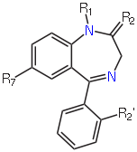
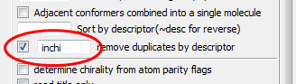
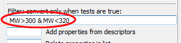

Filtering structures
====================

.. rubric:: Setup

We are going to use a dataset of 16 benzodiazepines. These all share the following substructure (image from Wikipedia_):

.. _Wikipedia: http://en.wikipedia.org/wiki/Benzodiazepine

* Create a folder on the Desktop called :file:`Work` and save benzodiazepines.sdf_ there
* Set up a conversion from SDF to SMI and set :file:`benzodiazepines.sdf` as the input file
* Tick :guilabel:`Display in Firefox`
* Click :guilabel:`CONVERT`

.. _benzodiazepines.sdf: ../_static/benzodiazepines.sdf

.. rubric:: Remove duplicates

If you look carefully at the depictions of the first and last molecules (top left and bottom right) you will notice that they depict the same molecule.

Q. Look at the SMILES strings for the first and last molecules. If the two molecules are actually the same, why are the two SMILES strings different? (Hint: try using ``CAN - canonical SMILES`` instead of ``SMI``.)

We can remove duplicates based on the InChI (for example): 

* Tick the box beside :guilabel:`remove duplicates by descriptor` and enter ``inchi`` as the descriptor

* Click :guilabel:`CONVERT`

Duplicates can be removed based on any of the available descriptors. The full list can be found in the menu under :guilabel:`Plugins`, :guilabel:`descriptors`.

Q. Are any of the other descriptors useful for removing duplicates?

.. rubric:: Filtering by substructure

Q. How many of the molecules contain the following substructure?

.. figure:: ../_static/BenzoF.png

The SMILES string for this molecule is ``c1ccccc1F``. This is also a valid SMARTS string.

Q. Use the SMARTSviewer_ at the ZBH Center for Bioinformatics, University of Hamburg, to verify the meaning of the SMARTS string ``c1ccccc1F``.

.. _SMARTSviewer: http://smartsview.zbh.uni-hamburg.de/

.. sidebar:: Removing potentially toxic molecules

   Filtering a dataset of molecules by substructure is particularly useful
   if you need to remove molecules with problematic functional groups. For
   example, particular functional groups are associated with toxicological
   problems.

Let's filter the molecules using this substructure:

* In the Options section, enter ``c1ccccc1F`` into the box labeled :guilabel:`Convert only if match SMARTS or mols in file`
* Click :guilabel:`CONVERT`.

Q. How many structures are matched?

* Now find all those that are not matched by preceding the SMARTS filter with a tilde ``~``, i.e. ``~c1ccccc1F``.
* Click :guilabel:`CONVERT`.

Q. How many structures are not matched?

.. rubric:: Filter by descriptor

.. sidebar:: Screenshot

  .. figure:: ../_static/SortByMW.png

As discussed above, Open Babel provides several descriptors. Here we will focus on the molecular weight, ``MW``.

To begin with, let's show the molecular weights in the depiction:

* Clear the existing title by entering a single space into the box :guilabel:`Add or replace molecule title`
* Set the title to the molecular weight by entering ``MW`` into the box :guilabel:`Append properties or descriptors in list to title`
* Click :guilabel:`CONVERT`

You should see the molecular weight below each molecule in the depiction. Notice also that the SMILES output has the molecular weight beside each molecule. This could be useful for preparing a spreadsheet with the SMILES string and various calculated properties.

Now let's sort by molecular weight:

* Enter ``MW`` into the box :guilabel:`Sort by descriptor` and click :guilabel:`CONVERT`

Finally, here's how to filter based on molecular weight. Note that none of the preceding steps are necessary for the filter to work. We will convert all those molecules with molecular weights between 300 and 320 (in the following expression ``&`` signifies Boolean AND):

* Enter ``MW>300 & MW<320`` into the box :guilabel:`Filter convert only when tests are true` and click :guilabel:`CONVERT`

.. sidebar:: Filter by property

  The SDF format, in common with some other file formats, allows 
  property fields for each molecule. Open Babel allows the user to filter
  using these, add the value to the title, remove or replace values.

Q. If ``|`` (the pipe symbol, beside Z on the UK keyboard) signifies Boolean OR, how would you instead convert all those molecules that do not have molecular weights between 300 and 320?

.. note:: Open Babel 2.3.2 allows specific substructures to be highlighted in a depiction. It also allows depictions to be aligned based on a substructure.
