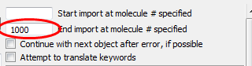
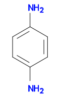
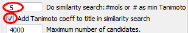

Substructure and similarity searching a large dataset
=====================================================

Open Babel provides a format called the ``fs -- fastsearch index`` which should be used when searching large datasets (like ChEMBL) for molecules similar to a particular query. There are faster ways of searching (like using a chemical database) but FastSearch is convenient, and should give reasonable performance for most people.

To demonstrate similarity searching, we will use the first 1000 molecules in the latest release of ChEMBL:

* Download the 2D SDF version of ChEMBL, :file:`chembl_nn.sdf.gz`, from the `ChEMBLdb download site`_ and save in your `Work` folder. (Note: this is a gzipped file, but Open Babel will handle this without problems.)
* Set up an SDF to SDF conversion, set :file:`chembl_nn.sdf.gz` as the input file and :file:`1000_chembl.sdf` as the output file.
* Only convert the first 1000 molecules by entering ``1000`` in the box :guilabel:`End import at molecule # specified`.

* Click :guilabel:`CONVERT`

.. _ChEMBLdb download site: ftp://ftp.ebi.ac.uk/pub/databases/chembl/ChEMBLdb/latest/

We can going to use the following structure for substructure and similarity searching. It can be represented by the SMILES string ``Nc1ccc(N)cc1``.

.. sidebar:: How the search works
   
    Behind the scenes, the FastSearch index simply stores a path-based
    binary fingerprint for each molecule. When used to search, similarity
    is measured based on the Tanimoto coefficient. For exact search, hits
    are verified by Open Babel's graph isomorphism matcher.

Next, we will create a FastSearch index for this dataset of 1000 molecules:

* Convert :file:`1000_chembl.sdf` from SDF to FS format, with an output filename of :file:`1000_chembl.fs`

By using this FastSearch index, the speed of substructure and similarity searching is much improved. First of all, let's do a substructure search:

* Set up a conversion from FS to SMILES with :file:`1000_chembl.fs` as the input file. Tick the box for :guilabel:`Output below only` and :guilabel:`Display in Firefox`
* Enter ``Nc1ccc(N)cc1`` into the box :guilabel:`Convert only if match SMARTS or mol in file`
* Click :guilabel:`CONVERT`

Q. How does the speed of the substructure search compare to if you used :file:`1000_chembl.sdf` as the input file instead?

Next, let's find the 5 most similar molecules to the same query. The Tanimoto coefficient of a path-based fingerprint is used as the measurement of similarity. This has a value from 0.0 to 1.0 (maximum similarity) and we will display the value below each molecule:

* Set up the FS to SMILES conversion as before, and again enter ``Nc1ccc(N)cc1`` into the box :guilabel:`Convert only if match SMARTS or mol in file`
* Enter ``5`` into the box :guilabel:`Do similarity search: #mols or # as min Tanimoto`
* Tick the box :guilabel:`Add Tanimoto coefficient to title in similarity search`
* Click :guilabel:`CONVERT`

Q. Look at the 5 most similar molecules. Can you tell why they were regarded as similar to the query?

