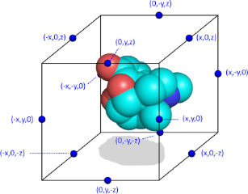

.. include:: <xhtml1-symbol.txt>
.. include:: <isolat1.txt>

Spectrophores\ |trade|
======================

.. |specs_tm| replace:: Spectrophores\ |trade|
.. |specs| replace:: Spectrophores
.. |spec_tm| replace:: Spectrophore\ |trade|
.. |spec| replace:: Spectrophore

Introduction
------------

|specs|\ [#trademark]_ are one-dimensional descriptors generated from the property
fields surrounding the molecules. The technology allows the accurate description
of molecules in terms of their surface properties or fields. Comparison of
molecules' property fields provides a robust structure-independent method of
aligning actives from different chemical classes. When applied to molecules such
as ligands and drugs, |specs| can be used as powerful molecular
descriptors in the fields of chemoinformatics, virtual screening, and QSAR
modeling.

.. sidebar:: Commercial Support for Spectrophores

   .. image:: ../_static/silicos.png
      :align: center
      :scale: 50
   
   Commercial support for Spectrophores is available from Silicos NV, the
   developers of the Spectrophore technology.
  
   Silicos is a fee-for-service company empowering open source chemo-informatics virtual screening technologies for the discovery of novel lead compounds and database characterization. Silicos fully endorses the concept of open innovation and open source software development, and provides its clients with a wide variety of computational chemistry-based lead discovery services, including Open Babel support, training and code development. Please visit Silicos_ for more details.

.. _Silicos: http://www.silicos.com

The computation of |specs| is independent of the position and
orientation of the molecule and this enables easy and fast comparison of
|specs| between different molecules. Molecules having similar
three-dimensional properties and shapes always yield similar |specs|.
A |spec| is calculated by surrounding the three-dimensional
conformation of the molecule by a three-dimensional arrangement of points,
followed by calculating the interaction between each of the atom properties and
the surrounding the points. The three-dimensional arrangement of the points
surrounding the molecule can be regarded as an 'artificial' cage or receptor,
and the interaction calculated between the molecule and the cage can be regarded
as an artificial representation of an affinity value between molecule and cage.
Because the calculated interaction is dependent on the relative orientation of
the molecule within the cage, the molecule is rotated in discrete angles and the
most favorable interaction value is kept as final result. The angular stepsize
at which the molecule is rotated along its three axis can be specified by the
user and influences the accuracy of the method.

The Spectrophore code was developed by Silicos NV, and donated to the OpenBabel project in July 2010 (see sidebar for information on commercial support). Spectrophores can be generated either using the command-line application :command:`obspectrophore` (see next section) or through the API (``OBSpectrophore``, as described in the :obapi:`API documentation <OBSpectrophore>`).

obspectrophore
--------------

.. rubric:: Usage

``obspectrophore -i <input file> [options]``

.. rubric:: Parameter details

-i <input file>  *Specify the input file*

    Spectrophores will be calculated for each molecule in the input file.
    The filetype is automatically detected from the file extension.

-n <type>  *The type of normalization that should be performed*

    Valid values are (without quotes):

      -  No (default)
      -  ZeroMean
      -  UnitStd
      -  ZeroMeanAndUnitStd

-a <accuracy>  *The required accuracy expressed as the angular stepsize*

    Only the following discrete values are allowed:
        1, 2, 5, 10, 15, 20 (default), 30, 36, 45, 60

-s <type>  *The kind of cages that should be used*
        
    The cage type is specified in terms of
    the underlying pointgroup: P1 or P-1. Valid values are (without quotes):

      -  No (default)
      -  Unique
      -  Mirror
      -  All

-r <resolution>  *The required resolution expressed as a real positive number*

    The default value is 3.0 Angstrom. Negative values or a value equal
    to 0 generates an error message

-h  *Displays help*

Implementation
--------------

Atomic properties
~~~~~~~~~~~~~~~~~

The calculation of a |spec_tm| starts by calculating the atomic
contributions of each property from which one wants to calculate a
|spec| from. In the current implementation, four atomic properties are
converted into a |spec|; these four properties include the atomic
partial charges, the atomic lipohilicities, the atomic shape deviations and the
atomic electrophilicities. The atomic partial charges and atomic electrophilicity
properties are calculated using the electronegativity equalisation method (EEM)
as described by Bultinck and coworkers [bll2002]_ [blc2003]_.
Atomic lipophilic potential
parameters are calculated using a rule-based method. Finally, the atomic shape
deviation is generated by calculating, for each atom, the atom's deviation from
the average molecular radius. This is done in a four step process:

- The molecular center of geometry (COG) is calculated
- The distances between each atom and the molecular COG are calculated
- The average molecular radius is calculated by averaging all the atomic
  distances
- The distances between each atom and the COG are then divided by the average
  molecular radius and centered on zero

Interaction between the atoms and cage points
~~~~~~~~~~~~~~~~~~~~~~~~~~~~~~~~~~~~~~~~~~~~~

Following the calculation of all required atomic properties, the next step in
the calculation of a |spec| consists of determining the total
interaction value V(c,p) between each of the atomic contributions of
property p with a set of interaction points on an artificial cage c
surrounding the molecular conformation.

   **Schematic representation of a molecule surrounded by the artifical cage**

For this purpose, each of these
interaction points i on cage c is assigned a value P(c,i)
which is either +1 or -1, with the constraint that the sum of all interaction
points on a particular cage should be zero. In a typical |spec|
calculation, a cage is represented as a rectangular box encompassing the
molecular conformation in all three dimensions, with the centers of the box
edges being the interaction points. Such a configuration gives twelve
interaction points per cage, and, in the case of a non-stereospecific
distribution of the interaction points, leads to 12 different cages. Although
there are no particular requirements as to the dimensions of the rectangular
cage, the distance between the interaction points and the geometrical extremes
of the molecule should be such that a meaningful interaction value between each
cage point and the molecular entity can be calculated. In this respect, the
default dimensions of the cage are constantly adjusted to enclose the molecule
at a minimum distance of 3 A along all dimensions. This cage size can be
modified by the user and influences the resolution of the |spec|.

The total interaction value V(c,p) between the atomic contribution values
A(j,p) of property p for a given molecular conformation and the
cage interaction values P(c,i) for a given cage c is calculated
according a standard interaction energy equation. It takes into account the
Euclidean distance between each atom and each cage point. This total interaction
V(c,p) for a given property p and cage c for a given
molecular conformation is minimized by sampling the molecular orientation along
the three axis in angular steps and the calculation of the interaction value for
each orientation within the cage.

The final total interaction V(c,p) for
a given cage c and property p corresponds to the lowest
interaction value obtained this way, and corresponds to the c'th value in
the one-dimensional |spec| vector calculated for molecular property
p. As a result, a |spec| is organized as a vector of minimized
interaction values V, each of these organized in order of cages and
property values. Since for a typical |spec| implementation twelve
different cages are used, the total length of a |spec| vector equals
to 12 times the number of properties. Since four different properties are used
in the current implementation (electrostatic, lipophilic, electrophilic
potentials, and an additional shape index as described before), this leads to a
total |spec| length of 48 real values per molecular conformation.

Since |spec| descriptors are dependent on the actual
three-dimensional conformation of the molecule, a typical analysis includes the
calculation of |specs| from a reasonable set of different
conformations. It is then up to the user to decide on the most optimal strategy
for processing the different |spec| vectors. In a typical virtual
screening application, calculating the average |spec| vector from all
conformations of a single molecule may be a good strategy; other applications
have benefit from calculating a weighted average or the minimal values.
For each molecule in the input file, a |spec| is calculated and
printed to standard output as a vector of 48 numbers (in the case of a
non-stereospecific |spec|. The 48 doubles are organised into 4 sets
of 12 doubles each:

- numbers 01-11: |spec| values calculated from the atomic partial charges;
- numbers 13-24: |spec| values calculated from the atomic lipophilicity properties;
- numbers 25-36: |spec| values calculated from the atomic shape deviations;
- numbers 37-48: |spec| values calculated from the atomic electrophilicity properties;

Choice of Parameters
--------------------

Accuracy
~~~~~~~~

As already mentioned, the total interaction between cage and molecule for a
given property is minimized by sampling the molecular orientation in angular
steps of a certain magnitude. As a typical angular step size, 20 degrees was found to
be the best compromise between accuracy and computer speed. Larger steps sizes
are faster to calculate but have the risk of missing the global interaction
energy minimum, while smaller angular steps sizes do sample the rotational space
more thoroughly but at a significant computational cost. The accuracy can be
specified by the user using the ``-a`` option.

Resolution
~~~~~~~~~~

|specs| capture information about the property fields surrounding the
molecule, and the amount of detail that needs to be captured can be regulated by
the user. This is done by altering the minimal distance between the molecule and
the surrounding cage. The resolution can be specified by the user with the
``-r`` option. The default distance along all dimensions is 3.0 Angstrom.
The larger the distance, the lower the resolution. With a higher resolution,
more details of the property fields surrounding the molecule are contained by
the |spec|. On the contrary, low resolution settings may lead to a more
general representation of the property fields, with little or no emphasis on
small local variations within the fields. Using a low resolution can be the
method of choice during the initial virtual screening experiments in order to get
an initial, but not so discriminative, first selection. This initial selection
can then further be refined during subsequent virtual screening steps using a
higher resolution. In this setting, small local differences in the fields between
pairs of molecules will be picked up much more easily.
The absolute values of the individual |spec| data points are dependent
on the used resolution. Low resolution values lead to small values of the
calculated individual |spec| data points, while high resolutions will
lead to larger data values. It is therefore only meaningful to compare only
|specs| that have been generated using the same resolution settings or
after some kind of normalization is performed.
Computation time is not influenced by the specified resolution, hence the
computation time is identical for all different resolution settings.

Stereospecificity
~~~~~~~~~~~~~~~~~

Some of the cages that are used to calculated |specs| have a
stereospecific distribution of the interaction points. The resulting
interaction valus resulting from these cages are therefore sensitive to the
enantiomeric configuration of the molecule within the cage. The fact that both
stereoselective as well as stereo non-selective cages can be used makes it
possible to include or exclude stereospecificity in the virtual screening
search. Depending on the desired output, the stereospecificity of
|specs| can be specified by the user using the ``-s`` option:

- No stereospecificity (default). |specs| are generated using cages
  that are not stereospecific. For most applications, these |specs|
  will suffice.
- Unique stereospecificity. |specs| are generated using unique
  stereospecific cages.
- Mirror stereospecificity. Mirror stereospecific |specs| are
  |specs| resulting from the mirror enantiomeric form of the input
  molecules.

The differences between the corresponding data points of unique and mirror
stereospecific |specs| are very small and require very long
calculation times to obtain a sufficiently high quality level. This increased
quality level is triggered by the accuracy setting and will result in
calculation times being increased by at least a factor 100. As a consequence, it
is recommended to apply this increased accuracy only in combination with a
limited number of molecules, and when the small differences between the
stereospecific |specs| are really critical. However, for the vast
majority of virtual screening applications, this increased accuracy is not
required as long as it is not the intention to draw conclusions about
differences in the underlying molecular stereoselectivity. Non-stereospecific
|specs| will therefore suffice for most applications.

Normalisation
~~~~~~~~~~~~~

It may sometimes be desired to focus on the relative differences between the
|spec| data points rather than focussing on the absolute differences.
In these cases, normalization of |specs| may be required. The current
implementation offers with the ``-n`` option the possibility to normalize in four
different ways:

- No normalization (default);
- Normalization towards zero mean;
- Normalization towards standard deviation;
- Normalization towards zero mean and unit standard deviation.

In all these cases, normalization is performed on a 'per-property' basis, which
means that the data points belonging to the same property set are treated as a
single set and that normalization is only performed on the data points within
each of these sets and not across all data points.

Normalization may be important when comparing the |specs| of charged
molecules with those of neutral molecules. For molecules carrying a global
positive charge, the resulting |spec| data points of the charge and
electrophilicity properties will both be shifted in absolute value compared to
the corresponding data points of the respective neutral species. Normalization
of the |specs| removes the original magnitude differences for the data
points corresponding to the charge and electrophilicity properties of charged
and neutral species. Therefore, if the emphasis of the virtual screening
consists of the identification of molecules with similar property fields without
taking into account differences in absolute charge, then |specs|
should be normalized towards zero mean. However, if absolute charge differences
should be taken into account to differentiate between molecules, unnormalized
|specs| are recommended.

.. [bll2002] P. Bultinck,  W. Langenaeker,  P. Lahorte,  F. De Proft, P.
                 Geerlings, C. Van Alsenoy, and J. P. Tollenaere.
                 **The Electronegativity Equalization Method II: Applicability of Different Atomic Charge Schemes.**
                 *J. Phys. Chem. A* **2002**, *106*, 7895-7901.
                 [`Link <http://dx.doi.org/10.1021/jp020547v>`__]

.. [blc2003] Patrick Bultinck, Wilfried Langenaeker, Ramon Carb\ |oacute|\ -Dorca, and Jan P. Tollenaere.
         **Fast Calculation of Quantum Chemical Molecular Descriptors from the Electronegativity Equalization Method.**
         *J. Chem. Inf. Comput. Sci.* **2003**, *43*, 422-428.
         [`Link <http://dx.doi.org/10.1021/ci0255883>`__]

.. rubric:: Footnotes

.. [#trademark] Spectrophore is a registered trademark of Silicos NV.

