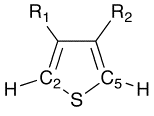
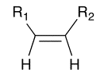

Perl
====

.. highlight:: perl

Installation
------------

The Perl bindings are available only on MacOSX and Linux. (We could not get them to work on Windows.) See :ref:`Compile bindings` for information on how to configure CMake to compile and install the Perl bindings.

Using Chemistry::OpenBabel
--------------------------

The Chemistry::OpenBabel module is designed to allow Perl scripts
to use the C++ Open Babel library. The bindings are generated using
the SWIG package and provides access to almost all of the Open
Babel interfaces via Perl, including the base classes OBMol,
OBAtom, OBBond, and OBResidue, as well as the conversion framework
OBConversion.

.. sidebar:: PerlMol

  For developing chemistry in Perl, you should also look at the `PerlMol <http://perlmol.org/>`_ project.

As such, essentially any call in the C++ API is available to Perl
access with very little difference in syntax. This guide is
designed to give examples of common Perl syntax for
Chemistry::OpenBabel and pointers to the appropriate sections of
the `API documentation <http://openbabel.sourceforge.net/api/>`_.

For more examples of using Open Babel inside Perl, see the
`developer Perl tutorial </wiki/Developer:Perl_Tutorial>`_.

The example script below creates atoms and bonds one-by-one using
the OBMol, OBAtom, and OBBond classes.

::

     #!/usr/bin/perl
    
     use Chemistry::OpenBabel;
    
     my $obMol = new Chemistry::OpenBabel::OBMol;
    
     $obMol->NewAtom();
     $numAtoms = $obMol->NumAtoms(); # now 1 atom
    
     my $atom1 = $obMol->GetAtom(1); # atoms indexed from 1
     $atom1->SetVector(0.0, 1.0, 2.0);
     $atom1->SetAtomicNum(6); # carbon atom
    
     $obMol->NewAtom();
     $obMol->AddBond(1, 2, 1); # bond between atoms 1 and 2 with bond order 1
     $numBonds = $obMol->NumBonds(); # now 1 bond
    
     $obMol->Clear();
     

More commonly, Open Babel can be used to read in molecules using
the OBConversion framework. The following script reads in molecular
information (a SMI file) from a string, adds hydrogens, and writes
out an MDL file as a string.

::

     #!/usr/bin/perl
    
     use Chemistry::OpenBabel;
    
     my $obMol = new Chemistry::OpenBabel::OBMol;
     my $obConversion = new Chemistry::OpenBabel::OBConversion;
     $obConversion->SetInAndOutFormats("smi", "mdl");
     $obConversion->ReadString($obMol, "C1=CC=CS1");
    
     $numAtoms = $obMol->NumAtoms(); # now 5 atoms
    
     $obMol->AddHydrogens();
     $numAtoms = $obMol->NumAtoms(); # now 9 atoms
    
     my $outMDL = $obConversion->WriteString($obMol);
     

The following script writes out a file using a filename, rather
than reading and writing to a Perl string.

::

     #!/usr/bin/perl
    
     use Chemistry::OpenBabel;
    
     my $obMol = new Chemistry::OpenBabel::OBMol;
     my $obConversion = new Chemistry::OpenBabel::OBConversion;
     $obConversion->SetInAndOutFormats("pdb", "mol2");
     $obConversion->ReadFile($obMol, "1ABC.pdb");
    
     $obMol->AddHydrogens();
    
     print "# of atoms: $obMol->NumAtoms()";
     print "# of bonds: $obMol->NumBonds()";
     print "# of residues: $obMol->NumResidues()";
    
     $obConversion->WriteFile($obMol, "1abc.mol2");
     

Examples
--------

Output Molecular Weight for a Multi-Molecule SDF File
~~~~~~~~~~~~~~~~~~~~~~~~~~~~~~~~~~~~~~~~~~~~~~~~~~~~~

Let's say we want to print out the molecular weights of every molecule in an SD file. Why? Well, we might want to plot a histogram of the distribution, or see whether the average of the distribution is significantly different (in the statistical sense) compared to another SD file.

::

  use Chemistry::OpenBabel;

  my $obconversion = new Chemistry::OpenBabel::OBConversion;
  $obconversion->SetInFormat("sdf");
  my $obmol = new Chemistry::OpenBabel::OBMol;

  my $notatend = $obconversion->ReadFile($obmol, "../xsaa.sdf");
  while ($notatend) {
      print $obmol->GetMolWt(), "\n";
      $obmol->Clear();
      $notatend = $obconversion->Read($obmol);
  }

Add and Delete Atoms
~~~~~~~~~~~~~~~~~~~~

This script shows an example of deleting and modifying atoms to transform one structure to a related one. It operates on a set of substituted thiophenes, deletes the sulfur atom (note that R1 and R2 may contain sulfur, so the SMARTS pattern is designed to constrain to the ring sulfur), etc. The result is a substituted ethylene, as indicated in the diagrams.

::

  use Chemistry::OpenBabel;

  my $obMol = new Chemistry::OpenBabel::OBMol;
  my $obConversion = new Chemistry::OpenBabel::OBConversion;
  my $filename = shift @ARGV;

  $obConversion->SetInAndOutFormats("xyz", "mol");
  $obConversion->ReadFile($obMol, $filename);

  for (1..$obMol->NumAtoms()) {
      $atom = $obMol->GetAtom($_);
      # look to see if this atom is a thiophene sulfur atom
      if ($atom->MatchesSMARTS("[#16D2]([#6D3H1])[#6D3H1]")) {
          $sulfurIdx = $atom->GetIdx();
      # see if this atom is one of the carbon atoms bonded to a thiophene sulfur
      } elsif ($atom->MatchesSMARTS("[#6D3H1]([#16D2][#6D3H1])[#6]") ) {
          if ($c2Idx == 0) { $c2Idx = $atom->GetIdx(); }
          else {$c5Idx = $atom->GetIdx(); }
      }
  }

  # Get the actual atom objects -- indexing will change as atoms are added and deleted!
  $sulfurAtom = $obMol->GetAtom($sulfurIdx);
  $c2Atom = $obMol->GetAtom($c2Idx);
  $c5Atom = $obMol->GetAtom($c5Idx);

  $obMol->DeleteAtom($sulfurAtom);

  $obMol->DeleteHydrogens($c2Atom);
  $obMol->DeleteHydrogens($c5Atom);

  $c2Atom->SetAtomicNum(1);
  $c5Atom->SetAtomicNum(1);

  $obConversion->WriteFile($obMol, "$filename.mol");

